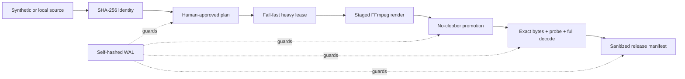

# Verified Video Pipeline

[](https://github.com/demidgost-sys/verified-video-pipeline/actions/workflows/ci.yml)
[](LICENSE)
[](pyproject.toml)

A small, offline reference implementation that turns human-approved video
artifacts into verifiable release evidence—without silently overwriting files,
skipping gates, or trusting stale state.

This is a reliability project, not an AI editor. Its public demo uses only
synthetic FFmpeg media and deliberately stops before cloud storage, OAuth, or
publishing.

## What this demonstrates

- exact-byte SHA-256 binding for source, approved edit plan, master, and release
  manifest;
- an explicit lifecycle that cannot skip the human approval or QA gates;
- compare-and-swap state transitions with a self-hashed write-ahead journal;
- crash recovery that rolls a valid interrupted transition forward;
- fail-fast project and machine-wide media leases—no invisible work queue;
- same-filesystem, hard-link-based promotion that never replaces an existing
  master;
- FFprobe contract checks plus a full, silent FFmpeg decode;
- a read-only status command that reports blockers without repairing state;
- synthetic end-to-end acceptance tests on macOS and Linux.

## 60-second proof

Requirements: Python 3.11+ and FFmpeg with `ffprobe`, H.264, and AAC support.

```bash
python3 -m venv .venv
source .venv/bin/activate
python -m pip install -e .
vvp doctor
vvp demo demo-run
```

The final report is intentionally machine-readable:

```json
{
  "blockers": [],
  "content_id": "synthetic-demo",
  "next_action": "none",
  "ready": true,
  "revision": 4,
  "schema_version": 1,
  "stage": "READY",
  "verification": "sha256"
}
```

The demo creates a three-second test pattern, binds a human-gate label to a
strict edit plan, renders a trimmed master, decodes the entire result, and
produces `release-manifest.json`. Generated video and runtime state are ignored
by Git.

To see fail-closed behavior on disposable demo output, change one byte and
rehash the registered artifacts:

```bash
python -c 'from pathlib import Path; p=Path("demo-run/master.mp4"); b=p.read_bytes(); p.write_bytes(b[:-1] + bytes([b[-1] ^ 1]))'
vvp status demo-run --verify
```

`ready` becomes `false` and `HASH_MISMATCH_MASTER` is reported. The tool does
not rewrite the artifact or pretend the old QA still proves the changed bytes.

## Architecture



Lifecycle:

```text
REGISTERED → PLAN_APPROVED → MASTER_READY → QA_PASSED → READY
```

Every state change uses an expected-before hash and a target hash. If the
process stops after journal preparation or after state replacement, `vvp
recover` can complete the exact recorded transition. If current state matches
neither side, recovery stops for operator review.

Read [architecture](docs/architecture.md), [failure model](docs/failure-model.md),
and [threat model](docs/threat-model.md) for the contracts and caveats.

## Commands

| Command | Responsibility |
|---|---|
| `vvp doctor` | Report the exact local FFmpeg/FFprobe versions. |
| `vvp demo PROJECT` | Build a new synthetic project through `READY`. |
| `vvp init PROJECT SOURCE --content-id ID` | Register source bytes already inside the project workspace. |
| `vvp approve-plan PROJECT PLAN --reviewer NAME` | Snapshot and hash-bind a strict, human-reviewed plan. |
| `vvp build PROJECT` | Render, validate, and promote a no-clobber master. |
| `vvp qa PROJECT` | Revalidate all upstream bytes and fully decode the master. |
| `vvp manifest PROJECT` | Create sanitized evidence for the exact QA-passed bytes. |
| `vvp recover PROJECT` | Roll forward an intact journal or build receipt. |
| `vvp status PROJECT [--verify]` | Inspect lifecycle and blockers without mutation. |

The public edit-plan contract is intentionally narrow. It accepts one trim and
one named encode profile; the trim must fit the registered source and the
rendered duration must match it within a documented codec tolerance. It never
accepts arbitrary FFmpeg arguments. See
[`examples/edit-plan.json`](examples/edit-plan.json) and the versioned
[`schemas/edit-plan.schema.json`](schemas/edit-plan.schema.json).
The JSON Schema covers structure; runtime validation owns the cross-field and
source-duration rules that standard JSON Schema cannot express.

## What it does not claim

- It does not choose good edits, verify teaching content, or replace human
  visual and editorial judgment.
- It does not upload to YouTube, call a cloud provider, manage OAuth, or prove
  remote byte identity.
- It is not a watcher, daemon, scheduler, or zero-touch publishing service.
- Synthetic FFmpeg acceptance does not prove OBS devices, permissions,
  production performance, or a real channel workflow.
- POSIX advisory locks and directory `fsync` improve failure behavior but cannot
  promise power-loss durability on every filesystem and controller.

The exact [public-demo boundary](docs/production-vs-demo.md) is part of the
design, not an omitted marketing detail.

## Why this repository is separate

The maintainer attests that this is a clean-room reference implementation
informed by failure modes observed in two isolated, private local video
workflows. No production Git history, account identifier, OAuth material, real
footage, transcript, release record, publication schedule, or project-specific
code was imported.

That separation keeps the public code reviewable and protects the private
systems from becoming accidental dependencies. The anonymized engineering
story is documented in the [case study](docs/case-study.md).

## Development

```bash
python -m pip install -e ".[dev]"
ruff check src tests scripts
ruff format --check src tests scripts
python -m unittest discover -s tests -v
python -m compileall -q src tests scripts
```

CI runs the unit suite and a real synthetic FFmpeg E2E on Ubuntu and macOS.
Actions are pinned to immutable commit SHAs. The CI job is read-only; the
separate CodeQL job receives only the required `security-events: write` scope.
Dependabot tracks action and packaging updates. The public-tree gate also scans
every reachable historical path and blob plus commit and annotated-tag
messages, not only the current files, before a release can proceed.

`v0.1.0` is the original GitHub source release and predates automated artifact
attestations; it remains unchanged and has no signed release assets. Future
strict `vX.Y.Z` tags use the fail-closed [release process](docs/release-process.md)
to build with a hash-locked Ubuntu/Python 3.11 package set, verify the wheel in a
clean environment, and transfer one immutable artifact to separate attestation
and publication jobs. The final job rechecks the public immutable-tag ruleset
shape and exact live tag; administrators separately maintain no-bypass tag rules
and Immutable Releases as defense in depth. Architecture, schemas, and examples
remain repository-level review artifacts. No PyPI release is claimed.

Before proposing a change, read [CONTRIBUTING.md](CONTRIBUTING.md),
[SECURITY.md](SECURITY.md), and [ASSET_PROVENANCE.md](ASSET_PROVENANCE.md).

## Roadmap

Version `0.1.0` is the intentionally small public proof. Future adapters enter
the repository only after two independent real workflows establish a stable,
generic contract; the public package is not wired back into production merely
because the demo works. See [ROADMAP.md](ROADMAP.md).

## License

Apache-2.0. See [LICENSE](LICENSE) and [NOTICE](NOTICE). FFmpeg is a system
dependency and is not redistributed; see [THIRD_PARTY.md](THIRD_PARTY.md).
