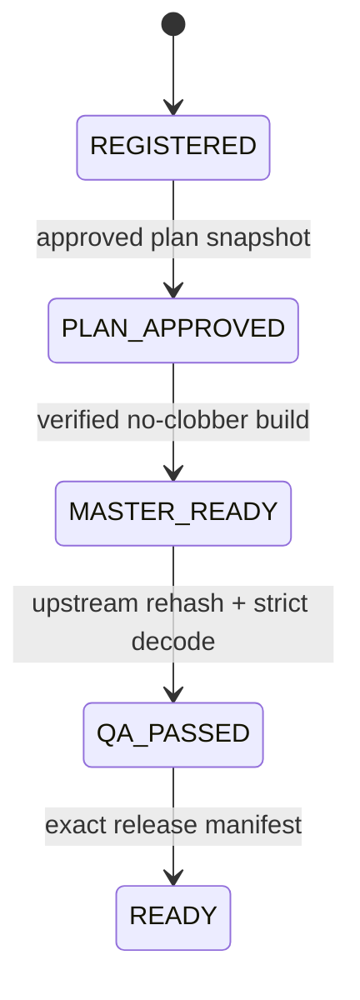

# Architecture

## Design goal

The system protects a simple claim: a release manifest refers to the same
source, approved plan, and master bytes that passed technical QA. A later file
mutation, interrupted write, concurrent heavy task, or stale state must not be
silently interpreted as success.

The implementation is deliberately local and single-project. It favors small,
inspectable POSIX primitives over a service, database, task broker, or cloud
control plane.

## Components

| Module | Contract |
|---|---|
| `hashing.py` | Hash regular files and reject mutation during the read. |
| `atomic.py` | Canonical JSON, same-directory temp write, `fsync`, atomic rename. |
| `journal.py` | Compare-and-swap state transition and roll-forward recovery. |
| `locks.py` | Non-blocking advisory project and machine-wide leases. |
| `state.py` | Versioned lifecycle and legal transition graph. |
| `media.py` | Narrow FFmpeg profile, probe normalization, strict decode. |
| `pipeline.py` | Gate ordering, build receipt, no-clobber promotion, manifest. |
| `cli.py` | Stable operator surface and non-zero expected-error exit. |

## Workspace contract

Runtime projects are data, not source code, and are ignored by Git. State uses
workspace-relative paths only:

```text
project/
├── source.mp4
├── approved-plan.json
├── master.mp4
├── release-manifest.json
├── project.json
└── .vvp.lock
```

During an interrupted operation the workspace can also contain
`journal.json`, `build-receipt.json`, or `.master.staged.mp4`.

An artifact must be a regular file below the resolved project root. Symlinks and
parent traversal are rejected. Source files outside the workspace are not
accepted by this public reference implementation.

## State transitions



There is no generic `set-status` operation. Each transition is owned by one
command that first proves its upstream invariants.

The edit plan is also bound to media semantics: its end time cannot exceed the
registered source duration, and the verified render duration must match the
requested range within `max(150 ms, 2%)` to allow normal codec padding without
accepting a truncated render.

## Journaled compare-and-swap

For every state transition:

1. Read and validate current `project.json`.
2. Construct and validate the complete next state.
3. Record `before_sha256`, `after_sha256`, and the full target in a self-hashed
   `journal.json`.
4. Re-read current state and compare it with `before_sha256`.
5. Atomically replace state with the target.
6. Remove and directory-`fsync` the journal.

Recovery rolls forward only when current state matches the journal's before or
after hash. Any third value is ambiguous and returns `RecoveryRequired`.

## Media commit

State journaling alone cannot make a multi-megabyte render atomic. The build
uses a second, artifact-specific receipt:

1. FFmpeg writes a same-directory staging file.
2. Probe, full decode, and SHA-256 complete against staged bytes.
3. A self-hashed receipt binds source hash, plan hash, staged path, and future
   master identity.
4. A hard link creates the final filename only if it does not already exist.
5. The staging directory entry is removed.
6. The journal advances state to `MASTER_READY`.
7. The build receipt is removed.

A crash after steps 3–6 is recoverable. An unrelated existing master is never
replaced. The hard-link promotion contract requires staging and target to be on
one filesystem.

## Read path

`status` never acquires a mutation lease and never calls recovery. Without
`--verify`, it checks lifecycle, required files, sizes, pending receipts, and
unregistered staging/master entries. With `--verify`, it also rehashes
registered artifacts. That distinction is reported as `size-only` or `sha256`
in the output.

## Deliberate limits

The state file is not a multi-writer database. Locks are advisory and protect
cooperating processes on POSIX systems. The implementation assumes a trusted
local operator and OS; it detects integrity drift, not a privileged adversary
who can rewrite both artifacts and evidence.
